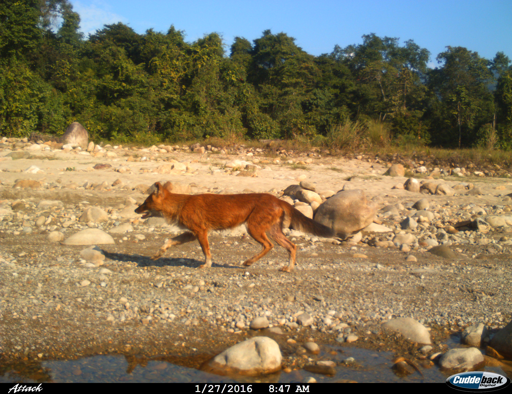
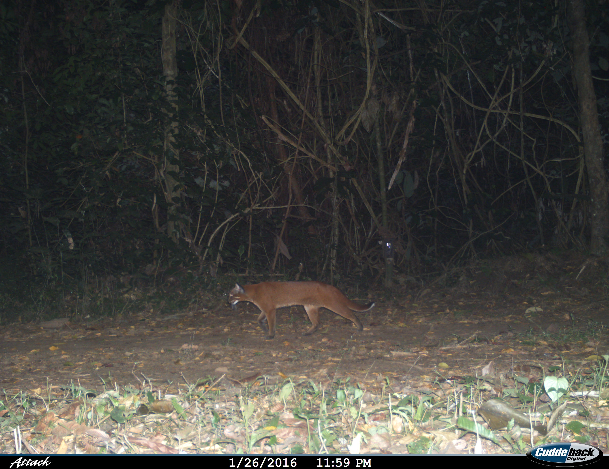
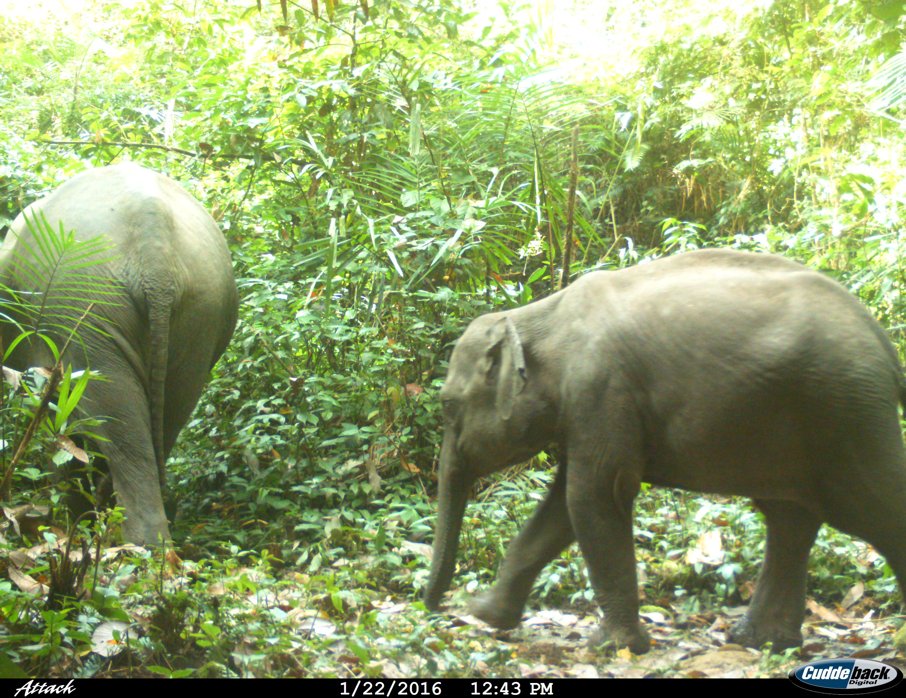

## Pakke Tiger Reserve Mammal Community

Pakke Tiger Reserve has a diverse mammal community. This page lists the mammals included in our multi species occupancy analysis of PTR mammalian communuty. 

# 1. Tiger (_Panthera tigris_)
 
 [Species information](https://animaldiversity.org/accounts/Panthera_tigris/) 

# 2.Indian leopard (_Panthera pardus fusca_)
 
 [Species information](https://animaldiversity.org/accounts/Panthera_pardus/) 

# 3.Indian wild dog (_Cuon alpinus_)
 
 [Species information](https://animaldiversity.org/accounts/Cuon_alpinus/) 

# 4.Clouded leopard (_Neofelis nebulosa_)
 
 [Species information](https://animaldiversity.org/accounts/Neofelis_nebulosa/) 

# 5.Golden cat (_Catopuma_temminckii_)
 
 [Species information](https://animaldiversity.org/accounts/Catopuma_temminckii/) 
 
# 6.Leopard cat (_Prionailurus_bengalensis_)
 
 [Species information](https://animaldiversity.org/accounts/Prionailurus_bengalensis/) 
 
 # 7.Marbled cat (_Pardofelis_marmorata_)
 
 [Species information](https://animaldiversity.org/accounts/Pardofelis_marmorata/) 

# 8.Asian elephant (_CElephas_maximus_)
 
 [Species information](https://animaldiversity.org/accounts/Elephas_maximus/) 
 
# 9.Leopard cat (_Prionailurus_bengalensis_)
 
 [Species information](https://animaldiversity.org/accounts/Prionailurus_bengalensis/) 
