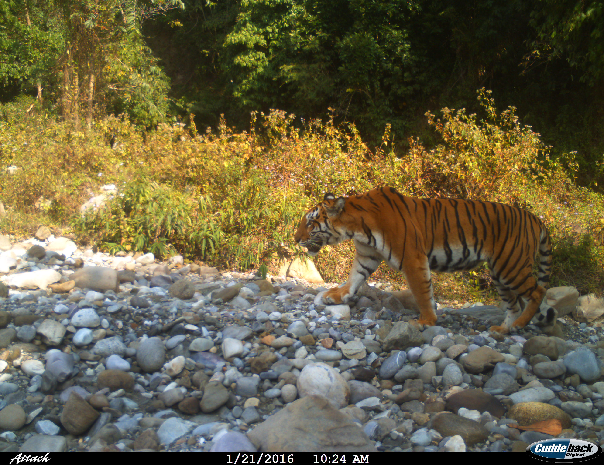

## Pakke Tiger Reserve Mammal Community

Pakke Tiger Reserve has a diverse mammal community. This page lists the mammals included in our multi species occupancy analysis of PTR mammalian communuty. 

# 1. Tiger (_Panthera tigris_)

[Link](url) 
 

