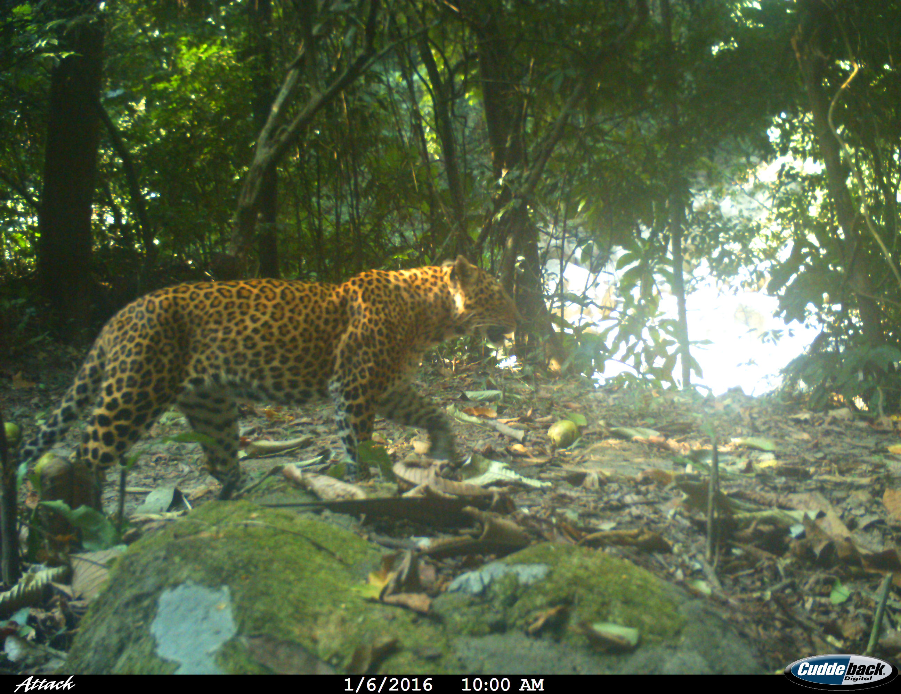

## Pakke Tiger Reserve Mammal Community

Pakke Tiger Reserve has a diverse mammal community. This page lists the mammals included in our multi species occupancy analysis of PTR mammalian communuty. 

# 1. Tiger (_Panthera tigris_)
 
 [Species information](https://animaldiversity.org/accounts/Panthera_tigris/) 

# 2. Indian leopard (_Panthera pardus fusca_)
 
 [Species information](https://animaldiversity.org/accounts/Panthera_pardus/) 

# 3. Indian wild dog (_Cuon alpinus_)
 
 [Species information](https://animaldiversity.org/accounts/Cuon_alpinus/) 

# 4. Clouded leopard (_Neofelis nebulosa_)
 
 [Species information](https://animaldiversity.org/accounts/Neofelis_nebulosa/) 

# 5. Golden cat (_Catopuma temminckii_)
 
 [Species information](https://animaldiversity.org/accounts/Catopuma_temminckii/) 
 
# 6. Leopard cat (_Prionailurus bengalensis_)
 
 [Species information](https://animaldiversity.org/accounts/Prionailurus_bengalensis/) 
 
# 7. Marbled cat (_Pardofelis marmorata_)
 
 [Species information](https://animaldiversity.org/accounts/Pardofelis_marmorata/) 

# 8. Asian elephant (_Elephas maximus_)
 
 [Species information](https://animaldiversity.org/accounts/Elephas_maximus/) 
 
# 9. Large Indian civet (_Viverra zibetha_)
 
 [Species information](https://animaldiversity.org/accounts/Viverra zibetha/) 

# 10. Small Indian civet (_Viverricula indica_)
 
 [Species information](https://animaldiversity.org/accounts/Viverricula_indica/) 
 
# 11. Common palm civet (_Paradoxurus hermaphroditus_)
 
 [Species information](https://animaldiversity.org/accounts/Paradoxurus_hermaphroditus/) 

# 12. Himalayan palm civet (_Paguma larvata_)
 [Species information](https://animaldiversity.org/accounts/Paguma_larvata/) 
 
# 13. Gaur (_Bos gaurus_)
 
 [Species information](https://animaldiversity.org/accounts/Bos_frontalis/) 

# 14. Capped langoor (_Trachypithecus pileatus_)
 

# 15. Himalayan palm civet (_Paguma larvata_)
 [Species information](https://animaldiversity.org/accounts/Paguma_larvata/) 
 
# 17. Binturong (_Arctictis binturong_)
 [Species information](https://animaldiversity.org/accounts/Arctictis_binturong/) 

 
 
# 18. Goral (_Naemorhedus goral_)
 [Species information](https://animaldiversity.org/accounts/Naemorhedus_goral/) 
 
 
# 19. Serow (_Naemorhedus_sumatraensis_)
 [Species information](https://animaldiversity.org/accounts/Capricornis_sumatraensis/) 
 
# 20. Sambar deer (_Rusa unicolor_)
 
 [Species information](https://animaldiversity.org/accounts/Capricornis_sumatraensis/) 
 
# 21. Barking deer (_Muntiacus_muntjak_)
 
 [Species information](https://animaldiversity.org/accounts/Muntiacus_muntjak/) 
 
# 22. Hog deer (_Axis_porcinus_)
 
 [Species information](https://animaldiversity.org/accounts/Axis_porcinus/) 
 
# 23. Rhesus macaque (_Macaca_mulatta_)
 [Species information](https://animaldiversity.org/accounts/Macaca_mulatta/) 
 
# 24.Assamese macaque (_Macaca_assamensis_)
 
 [Species information](https://animaldiversity.org/accounts/Macaca_mulatta/) 
 
 
 
 
 
